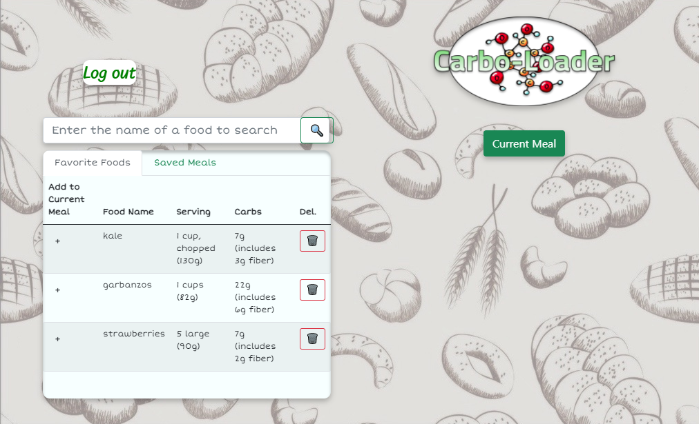
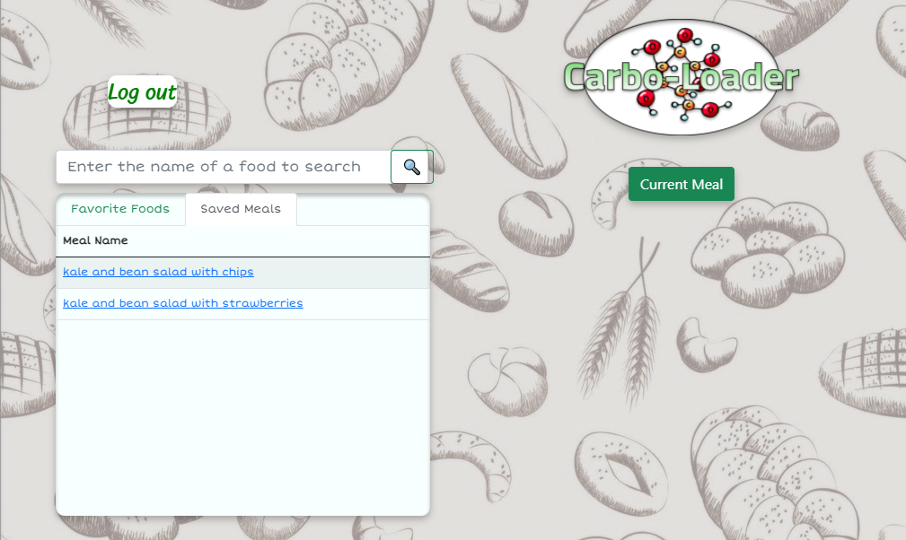
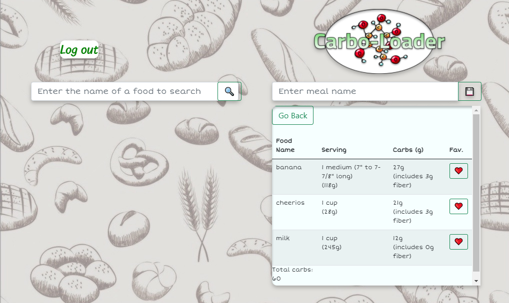

# Carbo Loader
## An app for users to track carbohydrate content of their food(s) for a meal 

[](https://opensource.org/licenses/MIT) 

## Description: 
This is an application where users can track the carbohydrates for their meals. The Nutritionix API node module is used to search and capture carbohydrate and fiber content, and users can also search for specific quantities. The search results can be added to a user's current meal and a carbohydrate total for the entire meal is tallied. Individual foods can be marked as a favorite for easy retrieval later and meals can be saved for future reference.  This application utilizes Node.js, a MySQL database,  Express server, Handlebars, Sequelize ORM, Express Session middleware for cookies, and bcrypt for password protection. 

## Table of Contents: 
* [Installation](#installation)
* [Usage](#usage) 
* [Future](#future) 
* [License](#license) 
* [Contributing](#contributing) 
* [Questions](#questions) 
## Installation: 

[Click here for deployed app](https://carbohydratetracker.herokuapp.com/) 

Or you can run it locally:
* You will need to have Node.js and MySQL installed. 
* Run ```npm install``` in your bash terminal to install the dependencies.
* Update your MySQL user and password in the ``` .env.EXAMPLE ``` file then rename it to ``` .env ```. 
* Run ```DROP DATABASE IF EXISTS carbcounter_db;``` and then```CREATE DATABASE carbcounter_db;``` in MySQL shell to create the database in MySQL. 
* Run ```npm start``` to initialize the server on your local machine, then once you get the message "App is listening on PORT: 3001", go to localhost:3001 in your browser. 


 
## Usage: 
From the landing page you can choose to either sign up or sign in.  Once signed in users can search for a food and results with carbohydrate content will be shown.  Clicking on the plus button to the left of the food name will add it to the user's current meal.  Clicking on the heart in the current meal view will add that food to a users favorite.  Users can also view a list of their favorites as well as a list of their previously saved meals. In the current meal view, there is a running tally of the total carbohydrates for the meal. Once the current meal contains all foods you will be eating, you can add a meal name and save it and the current meal section will be clear and ready for your next meal. Clicking on a title of a previous meal in the saved meal view will show all the individual foods the meal contained and clicking on the plus button will add the foods to a new current meal.  





## Future Development:
We look forward to adding the ability for users to enter their own custom foods,  giving the option to display the total dietary fiber of the current meal, the also the option for a user to view the net carbohydrates (total carbohydrates minus the dietary fiber). 

## License: 
Licensed under the [MIT](https://opensource.org/licenses/MIT) license. 

## Contributions:
Contributors for this project:  

[Matt Linder](https://github.com/mlin901)  

[Beau Barrier](https://github.com/beaubarrier)  

[Melina Boedecker](https://github.com/melinamboedecker)  

[Martin Armenta](https://github.com/MRAx09)

## Questions: 
If you have any additional questions, please contact me at melinamboedecker@gmail.com
